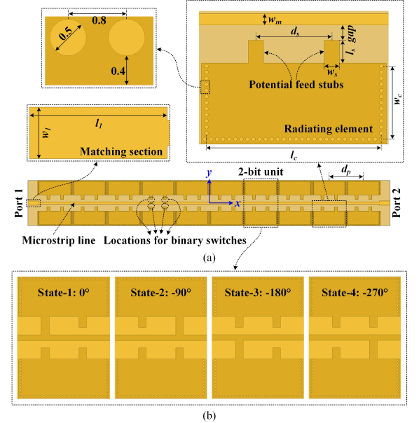
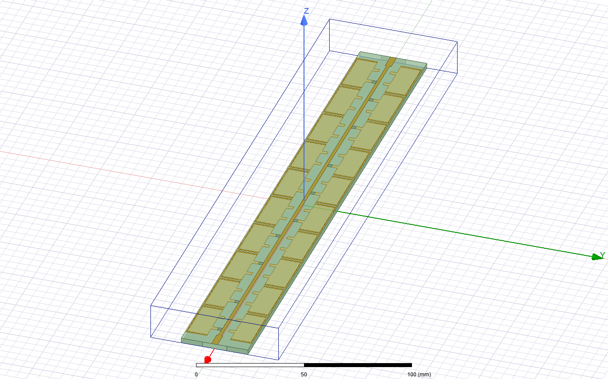

# 天线理论与技术课程设计

邹雨泽 D201677498

## 基于超表面的波束可重构天线技术研究

## 课题背景

可重构天线旨在通过改变天线的物理特性参数，使天线的某些辐射特性根据应用场景和应用需求加以改变。**方向图可重构天线**可以满足通信空间分集需求，在保持天线工作频率和极化方式不变的情况下改变天线的最大辐射方向，即方向图主瓣方向。相比于全向天线，能提高指定方向上的信号辐射或接受质量，又减少了不必要的能量辐射；相比于定向辐射天线，可以在不增加天线数量的情况下增加通信系统的灵活度；相比于相控阵天线，可以避免臣大的天线阵列和复杂的馈电系统，并且能极大降低通信系统成本。

## 应用场景

在商业应用方面，作为5G通信中的关键技术，大规模天线(Massive MIMO)技术通常使用密集天线阵列, 但是密集排布的天线不但会占据大量空间, 还会降低通信信道的自由度, 因而限制了多路复用增益的提高, 不利于通信性能的提高。相比之下, 天线可重构技术可以在不增加天线数量的情况下, 通过天线空间分集、辐射方向图分集或极化分集技术, 降低子信道的相关性, 进而提高通信系统容量。另外, 在移动卫星通信中, 车载、船载、机载等移动卫星通信应用的需求愈发强烈, 人们更希望交通工具在移动过程中保持卫星通信。但由于汽车、船只、飞机等移动交通工具在移动过程中位置和姿态不断变化, 普通天线难以保持辐射方向始终与通信卫星对准。而波束可重构天线可以根据交通工具的位置等信息计算出卫星相对位置, 改变天线辐射方向, 使交通工具在移动中实时保持卫星通信。

## 原理概述

本节介绍一维周期性排列的漏波单元设计一种波束可重构天线。

### 基片集成波导技术

矩形波导作为一种三维立体结构, 在与微带线等平面结构连接时往往需要复杂的三维连接结构, 吴柯等人于2001年提出了一种将微带线和矩形波导集成在同一个介质板上的方法[3], 简化了两者的连接结构, 使用这种方法设计出的结构被称为基片集成波导(Substrate integrated waveguide, SIW)。基片集成波导通过在微带线介质板上打下一系列金属孔来模拟波导的传播形式, 解决了波导体积过大而不易集成的难题。

     
    <b>图1. 基片集成波导示意图</b>

微带线结构具有体积小，重量轻，集成度高，工艺简单，成本低等优点，但是辐射泄露损耗大，品质因数低，在毫米波频段，这样的缺点尤为明显，因此限制了微带线在高频频段的应用。传统矩形波导虽然有着良好的电磁波传播特性，但是体积太大，不易集成，成本较高。而基片集成波导在避免了微带线和波导缺点的同时，又兼具了微带线和波导的优点：品质因数高，辐射损耗小，功率容量大，频带宽、抗电磁干扰能力强，并且体积小重量轻，容易设计、加工、集成，成本低。基片集成波导因其优势被广泛应于各种微波器件的设计中，例如天线、滤波器、功分器、振荡器、耦合器等等，尤其是在毫米波电路中，基片集成波导可以代替损耗高、Ｑ值低的微带线结构。除此之外，基片集成波导还支持高次模的传输，适合应用于高速信号传输系统的设计中，提高高速互连系统的数据传输速率以及频谱利用率.

基片集成波导是一种周期性结构，通常在PCB、LTCC上打金属过孔，起到金属电壁的作用，使电磁波被限制在通孔和金属平面共同形成的介质填充矩形波导内传输。基片集成波导上面的金属通孔为了减少损耗和电磁波泄露，需要满足如下条件:

$$
s< 2d, \quad d <0.2 w,
$$

其中$d$表示金属通孔直径；$s$代表金属通孔排列周期，即相邻两通孔间的距离；$w$表示两排金属通孔之间的距离。

**基片集成波导(Substrate Integrated Waveguide, SIW) + 微带线**

    

## 仿真建模

### 模型结构

    

## 参考文献

[1]. 刘丽. 基于超表面的波束可重构天线技术研究[D]. 2019.  
[2]. Chang L , Li Y , Zhang Z , et al. Reconfigurable 2-bit Fixed-Frequency Beam Steering Array Based on Microstrip Line[J]. IEEE Transactions on Antennas and Propagation, 2018, PP(99):1-1.  
[3]. Deslandes D , Wu K . Integrated microstrip and rectangular waveguide in planar form[J]. IEEE Microwave and Wireless Components Letters, 2002, 11(2):68-70.